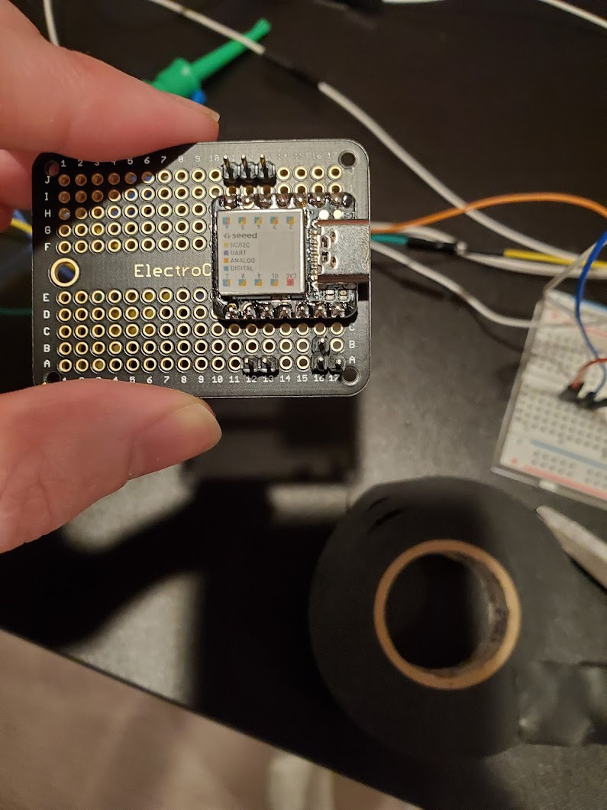
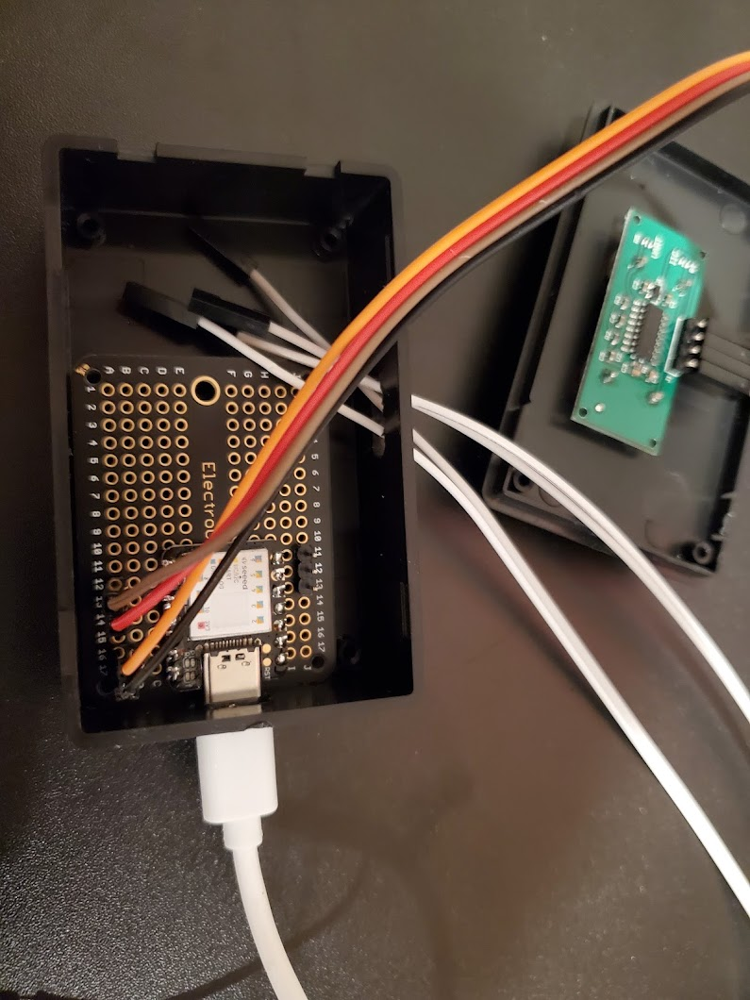
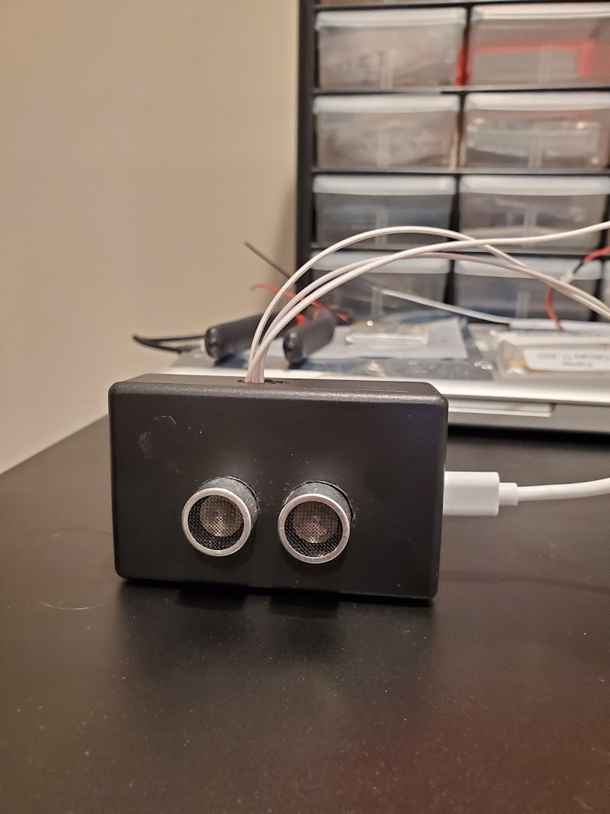

# Garage-Door-Sensor

This project helps the driver visually identify when they are getting close to the garage wall, leaving enough space to walk aroud the vehicle after parking.

The light will turn off after ~10 seconds of no motion detected, and has a fixed set distance for green, yellow, and red. Once the vehicle reaches a distance that turns on the red light, the max distance has been reached.

## Bill of Materials

- Adafruit RCWL-1601
  - https://www.adafruit.com/product/4007
- Seeedunio Xiao
  - https://www.amazon.com/Seeeduino-Smallest-Microcontroller-Interfaces-Compatible/dp/B08745JBRP/ref=sxts_rp_s_a1_0?crid=142A74IRZZ618&cv_ct_cx=seeeduino+xiao&keywords=seeeduino+xiao&pd_rd_i=B08745JBRP&pd_rd_r=7ed875e7-4480-4537-876b-dc9d5e0ea860&pd_rd_w=Cw9ZJ&pd_rd_wg=Lp6gy&pf_rd_p=ef09fc8b-f6fe-450c-ac89-05f354bc6e1d&pf_rd_r=9C32DT3EW511FQMHMJ5J&psc=1&qid=1645412465&sprefix=seeeduino+xiao%2Caps%2C63&sr=1-1-5985efba-8948-4f09-9122-d605505c9d1e
- Stemedu 8X8 64 LED Matrix WS2812 5050 RGB
  - https://www.amazon.com/gp/product/B07SQXCM87/ref=ppx_yo_dt_b_search_asin_title?ie=UTF8&psc=1
- Electrocookie Permaboard
  - https://www.amazon.com/gp/product/B07ZYNWJ1S/ref=ppx_yo_dt_b_search_asin_title?ie=UTF8&psc=1
- Black project box
  - https://www.amazon.com/gp/product/B07F462RYR/ref=ppx_yo_dt_b_search_asin_title?ie=UTF8&psc=1
- Power Drill
- Jumper wires

## Pictures

## Video

**https://imgur.com/Az41tyX**
